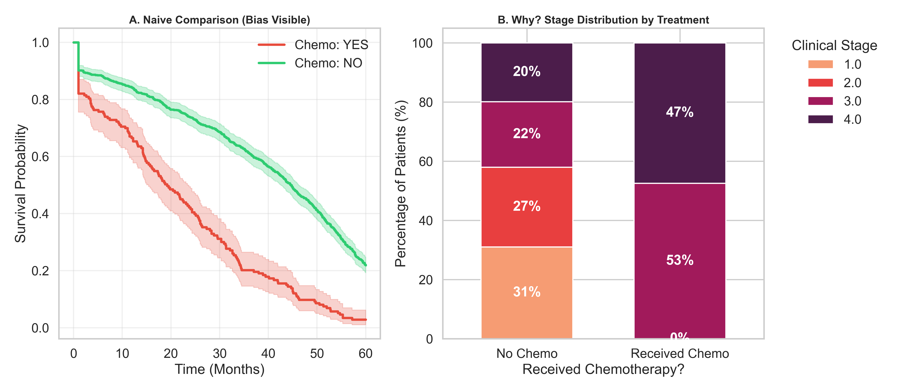

# 🧬 End-to-End Oncology Survival Prediction & Clinical Risk Stratification
### *From Raw Electronic Health Records (EHR) to Multivariate Cox Regression Models*


## 🏥 Project Overview
In the realm of precision medicine, understanding patient prognosis is crucial for treatment planning. However, real-world clinical data extracted from **Hospital Information Systems (HIS)** is rarely "analysis-ready." It is often unstructured, inconsistent, and plagued by missing values.

This project simulates a comprehensive **Clinical Data Science workflow** using a high-fidelity synthetic dataset of **1,500 cancer patients**. The goal is not merely to fit a model, but to demonstrate the rigorous process of transforming "dirty" raw data into actionable medical insights.

**Key Objectives:**
1.  **Data Wrangling:** Cleaning "messy" clinical entries (e.g., *'Stage IV'* vs *'Metastatic'*).
2.  **Smart Imputation:** Handling missing biomarkers using **Domain-Driven Logic** (e.g., imputing *Tumor Size* based on *Clinical Stage*).
3.  **Survival Modeling:** Quantifying mortality risk using **Stratified Cox Regression**.
4.  **Bias Detection:** Identifying and visualizing "Confounding by Indication" in chemotherapy outcomes.

---

## 🧹 The Data: "Real-World" Simulation
Unlike standard clean datasets (e.g., Titanic, Iris), this project utilizes a synthetic dataset generated to mimic the chaos of hospital logs.

**Challenges in the dataset included:**
* **Inconsistent Staging:** Mixed formats like `Stage IV`, `4`, `Metastatic`, `stg iv`.
* **Unstructured Text:** Comorbidities stored as strings (e.g., *"Diabetes; Hypertension | COPD"*).
* **Missing Biomarkers:** Randomized null values in critical fields like *Tumor Grade* and *Size*.
* **Censored Data:** Handling patients who survived beyond the study period.

---

## ⚙️ Methodology & Workflow

### 1. Data Cleaning & Feature Engineering
* **Regex Standardization:** Mapped inconsistent text entries to standardized clinical categories (TNM Staging).
* **Text Parsing:** Used `MultiLabelBinarizer` to deconstruct the 'Comorbidities' column into analyzable binary features.
* **Treatment Flags:** Parsed free-text treatment history to create binary flags for *Surgery, Chemotherapy, Radiotherapy,* and *Immunotherapy*.

### 2. Domain-Driven Imputation
Instead of simple mean imputation, a clinical approach was adopted:
* **Tumor Size:** Imputed using the **median** value grouped by **Clinical Stage**. (Logic: Stage IV tumors are statistically larger than Stage I).
* **Critical Biomarkers:** Rows with missing *Tumor Grade* or *Stage* were dropped (**Complete Case Analysis**) to prevent clinical bias.

### 3. Survival Analysis
* **Kaplan-Meier Estimator:** Estimated survival functions for different cancer types.
* **Log-Rank Test:** Performed multivariate and post-hoc pairwise comparisons (with Bonferroni correction) to validate statistical significance.

### 4. Risk Modeling (Cox Regression)
* **Assumption Checking:** Identified violations of the Proportional Hazards Assumption in the 'Stage' variable.
* **Stratification:** Implemented a **Stratified Cox Model** to control for the time-varying effect of staging.

---

## 📊 Key Insights & Visualizations

### A. Survival Profiles by Cancer Type
The Kaplan-Meier analysis revealed distinct prognostic profiles. **Pancreatic Cancer** demonstrated the steepest decline in survival probability, statistically significantly different from Breast and Colorectal cancers ($p < 0.001$).


### B. Comparative Clinical Dashboard
A comparison between the **Deceased** and **Survived** cohorts highlights the impact of **Recurrence** and **Tumor Grade**.


### C. The "Chemotherapy Paradox" (Bias Detection)
Initial analysis suggested that Chemotherapy increased mortality. Further investigation revealed this as **Confounding by Indication**: Chemotherapy was preferentially administered to Stage III/IV patients who already had a poor prognosis.



### D. Multivariate Risk Factors (Hazard Ratios)
The final Stratified Cox Model identified the following independent predictors of mortality:
* **Pancreatic Cancer:** HR ~3.0 (Highest Risk)
* **Recurrence:** HR ~2.5 (Critical Driver)
* **Surgery:** HR < 1.0 (Protective Factor)


---

## 🛠️ Installation & Usage

1. **Clone the repository:**
   ```bash
   git clone [https://github.com/orkunaran/survival_analysis_drug_trial.git](https://github.com/orkunaran/survival_analysis_drug_trial.git)
